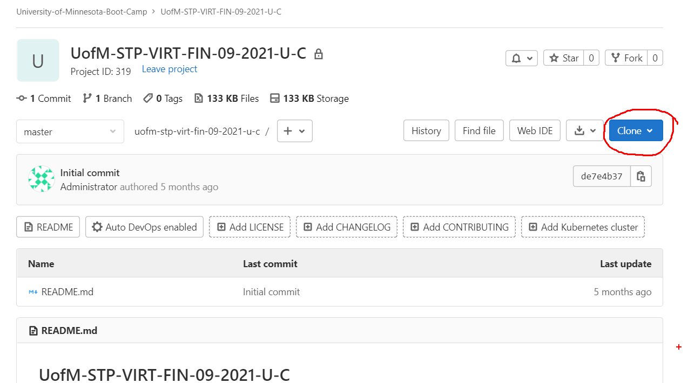
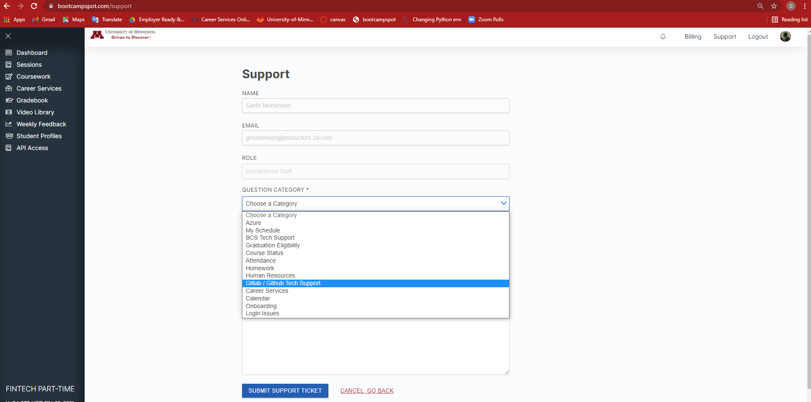

# UofM-STP-VIRT-FIN-09-2021-U-C

## About

This repo will house files needed for class.

## Reminder

### First Clone

You can clone this repo by clicking the clone button in the top right, and copy either the SSH or HTTPS strings.



From there, navigate to a folder, open git bash or terminal, and enter:

```bash
git clone string
```

where string is what you copied under the Clone button.

### Pull

To pull the latest content, navigate to the local folder containing the repo, open git bash or terminal, and enter:

```bash
git pull
```

Viola!

Please let us know via Slack if there are any missing files, etc!

## Support

Are you struggling? Remember that we have tutors available.


